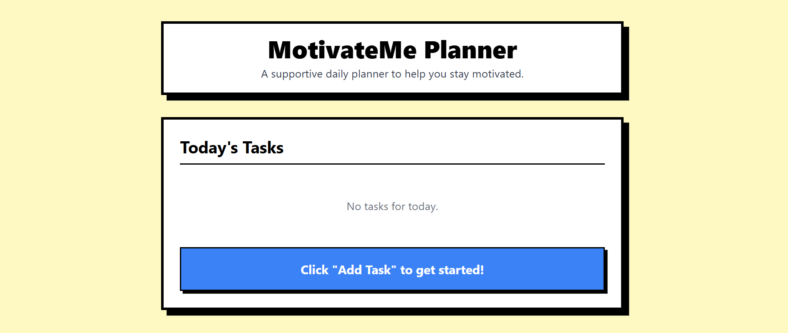

# MotivateMe


MotivateMe is a React-based web application designed to help users stay motivated and organized by managing their tasks effectively. The project leverages modern web development tools and frameworks, including Vite, TailwindCSS, and React.

## Features
- **Task Management**: Add, edit, and delete tasks.
- **Local Storage**: Persist tasks using the browser's local storage.
- **Responsive Design**: Styled with TailwindCSS for a mobile-friendly experience.

## Project Structure
```
src/
  App.jsx
  index.css
  main.jsx
  components/
    Footer.jsx
    Header.jsx
    TaskItem.jsx
    TaskList.jsx
  hooks/
    useLocalStorage.js
```

## Installation
1. Clone the repository:
   ```bash
   git clone <repository-url>
   ```
2. Navigate to the project directory:
   ```bash
   cd motivateme
   ```
3. Install dependencies:
   ```bash
   npm install
   ```

## Usage
### Development Server
Run the development server:
```bash
npm run dev
```

### Build for Production
Build the application for production:
```bash
npm run build
```

### Preview Production Build
Preview the production build:
```bash
npm run preview
```

## Technologies Used
- **React**: A JavaScript library for building user interfaces.
- **Vite**: A fast build tool and development server.
- **TailwindCSS**: A utility-first CSS framework.
- **PostCSS**: A tool for transforming CSS with JavaScript.
- **Autoprefixer**: A PostCSS plugin to parse CSS and add vendor prefixes.

## License
This project is licensed under the MIT License.

## Deployment

Check out the live version of the application:
[MotivateMe Deployment](https://motivate-me-neobrutalism-ui-git-main-guzxps-projects.vercel.app?_vercel_share=fw6sWqA0aJvRwNcy7a11anCxIOj6by27)


